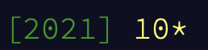

# Advent of Code

I will return periodically to finish some of these other challenges as I continue improving my python/general programming exploration.

## Summary of activities

**2021** I focused primarily on python during the release of the 2021 puzzles, using these to incorporate my learning from Ramalho's Fluent Python book. I had three major goals: 
1) Start with a docstring containing my quick method/plan of attack before coding
2) make the code readable (helped by adhering to a common python boilerplate)
3) for the more complex functions to have some sort of informative docstring, maybe with an example for doctests 